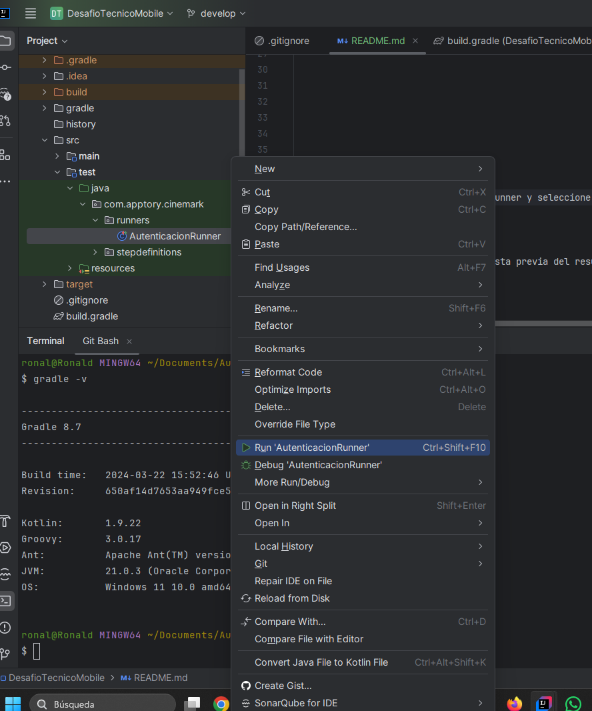

# Desafio técnico móvil

## Decripción y contexto
 
---  
Automatización de pruebas de la aplicación móvil de Cinemark para desafio técnico, 
creada con el patrón Screenplay utilizando el framework [Serenity BDD](https://serenity-bdd.github.io/docs/guide/user_guide_intro) y utilizando tecnologías Java, Selenium y Appium.

### Librerías

---
Requisitos para ejecutar **[JDK 21.0.3](https://www.oracle.com/co/java/technologies/downloads/#java21)** y **[gradle 8.7](https://gradle.org/install/)** o superior y **[Appium 2.0](https://appium.io/docs/en/2.0/intro/)**

Versiones de las bibliotecas con las que la automatización es estable:

+ Serenity 4.2.8

+ Selenium 4.17.0

+ Cucumber 7.14.0

+ Hamcrest-core 1.3

#### Ejemplo de comando de ejecución:

Para ejecutar un ejecutor específico:

```   gradlew clean test -Prunner="LoginRunner" aggregate --info ``` y en Ubuntu ```./gradlew clean test...```

Para ejecutar todas las pruebas:

```   gradlew clean test  aggregate  ```

---  

## Ejecución de pruebas

Para ejecutar desde el IDE en este caso Intellij, simplemente haga clic derecho en cada Runner y seleccione "Run (nombre del archivo)", como se muestra en la siguiente imagen:

---
Para generar información en la consola sobre la ejecución de las pruebas y obtener una vista previa del resultado, usamos la propiedad

«--info», como se muestra a continuación:

``` gradlew test -Prunner="LoginRunner" --info```

---

Para ejecutar todas las pruebas, puedes usar el siguiente comando en la consola:

``` gradlew test ``` y en Ubuntu ```./gradlew test```